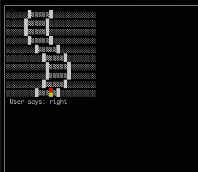
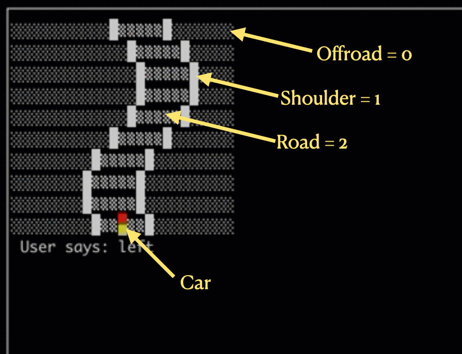
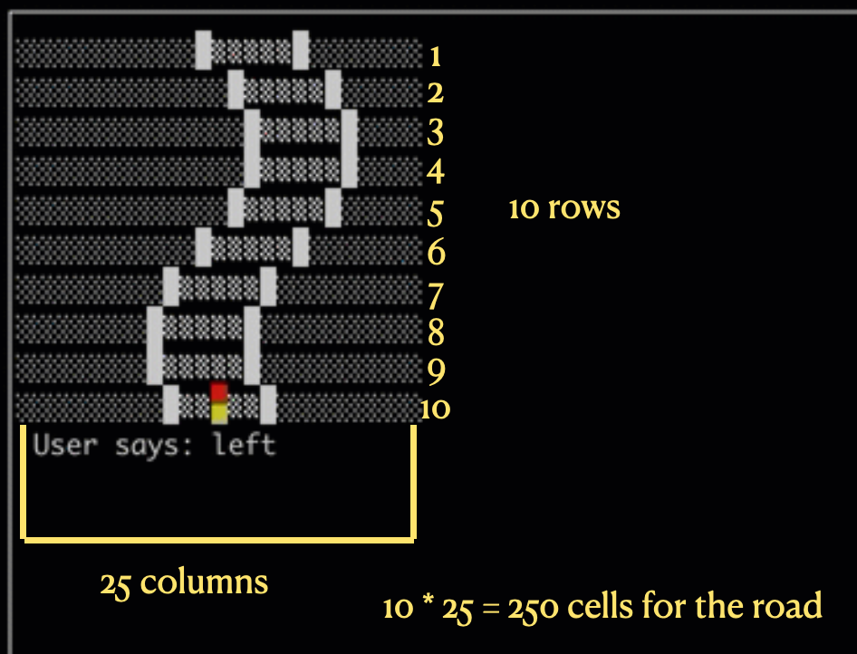
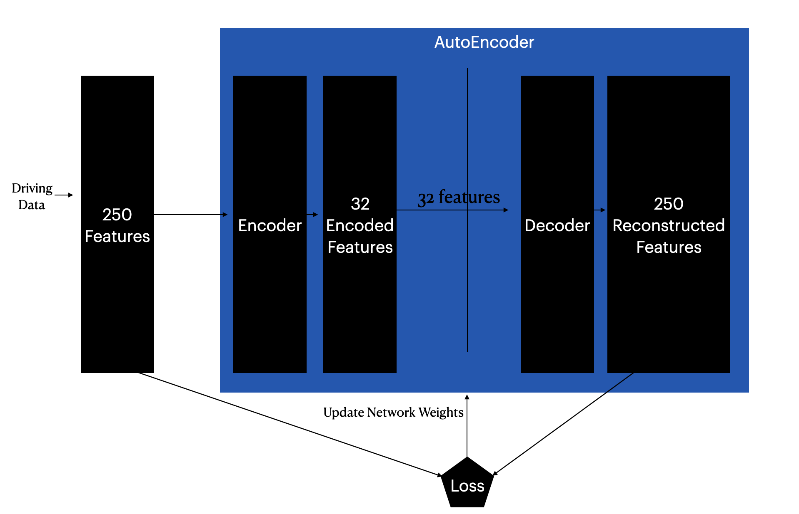
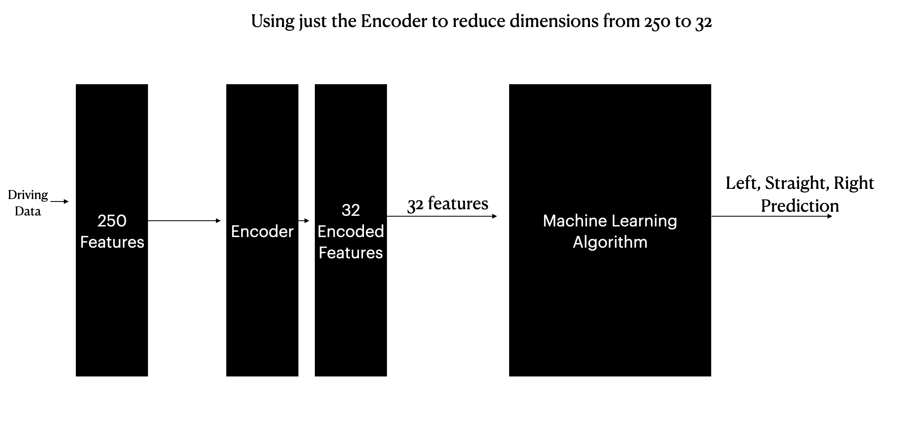

# Using AutoEncoders to reduce dimensionality in self-driving example



Can we train an '8-bit' car to drive?

We are going to use a simple, but relatable, example to apply machine learning.  We are then going to see how we can use a more advanced concept called AutoEncoders to reduce the dimensionality ( i.e. reduce the number of columns that we use to train and predict ) to see if we can reduce the size of the data and still capture enough to drive.

## Overview

Collect driving data ( left, right, straight ) which contains 250 features ( road is 10 rows by 25 columns ) and the target for driving instruction.

The training process collects:

* 150 samples

* 250 features ( flattened 10x25 road )

* 1 Target value.  One of Left (0), Straight (1), Right (2) 

Can we reduce the 250 features to a smaller number and still successfully drive the simulated car?

## Road Structure



## Road Data



## Install

```shell
pip install sklearn tensorflow pandas matplotlib jupyter
```

## Jupyter Notebook

See the Jupyter Notebook for a more detailed walk through of what the scripts are doing.


## Running the Scripts

---
### Collect Training Data

* Run `01_training.py` to collect training data.

The shape of the data will be 150 rows by 250 features and 1 label that represents the driving instruction.

Snapshots of the road configuration and the driving instruction are created and the road is flattened into a new sample.


---

### Train the model or Reduce Dimensionality

* Train the model or AutoEncode then Train

If you want to autoencode to reduce the dimensionality:

Run `autoencode_dim_reduction.py`.

This will by default reduce the 250 features to 32 and assume to use `training.csv`.  Both of these options can be changed.  The resulting reduced dimension training data will be saved in file like: `training_[dims].csv

Run `02_model_training.py` and provide the training data.  use the `--training-data` option to specify the training data file.  Default is `training.csv`, but if you autoencoded, then use the generated autoencoded training file name.

---

### Test by driving using the model

* Drive by model

Run `03_drive_by_model.py`.  If you want to use autoencoding, use the `--autoencode` option.  This will cause the script to read `encoder_scaler.pkl` and `encoder_model.h5` and use those during the simulated driving along with the `best_driving_model.sav`.

## How does an AutoEncoder work?



An AutoEncoder, in this example, is a fully connect neural network.

The raw driving sample are feed into the encoder neural network.  The output of the encoder neural network is a smaller number of nodes than the original input.

The smaller number of encoder output nodes are fed into a decoder network that returns the number of outputs to match the inputs.  The difference between the original 250 samples and the decoded 250 samples is performed.  The loss will then inform the network how to update the weights of the network to reduce the loss.

Ultimately the decoder is not used in this case.  It is only there to check that the smaller node representation contains as much information about the original input as possible in the smaller number of nodes.

The encoder network is used to take the original 250 features, and reduce those down to 32.

Those 32 features can then be used to train a traditional machine learning algorithm.




## Results

### Using all of the data

Using all of the 150 x 250 data points.  The cross_val_score using a KNN model is below:

```text
[0.83333333 0.9        0.86666667 0.9        0.86666667] 0.8733333333333334
```

### Using AutoEncoder to reduce the number of dimensions

```text
      Accuracy
Dims          
1     0.802500
2     0.770000
4     0.820000
8     0.825000
16    0.863333
32    0.870000
64    0.870000
128   0.870000
```

It appears that the minimum number of dimensions is around 32.

